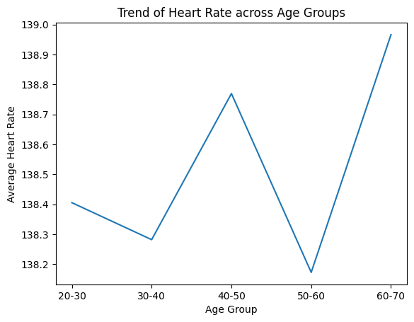
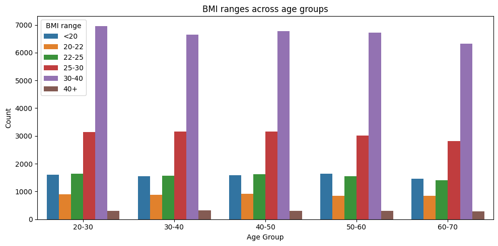
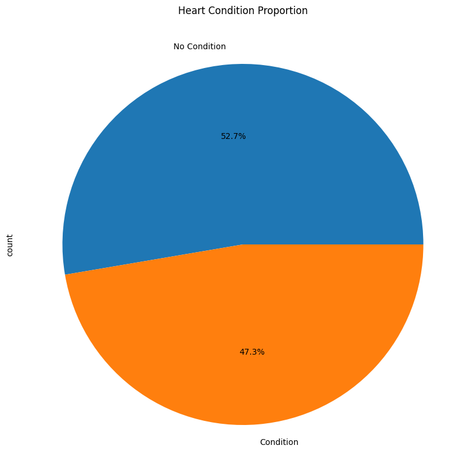
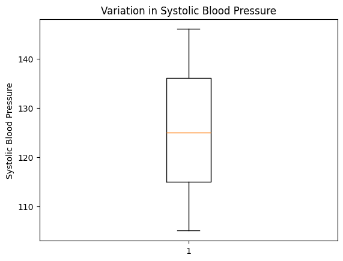
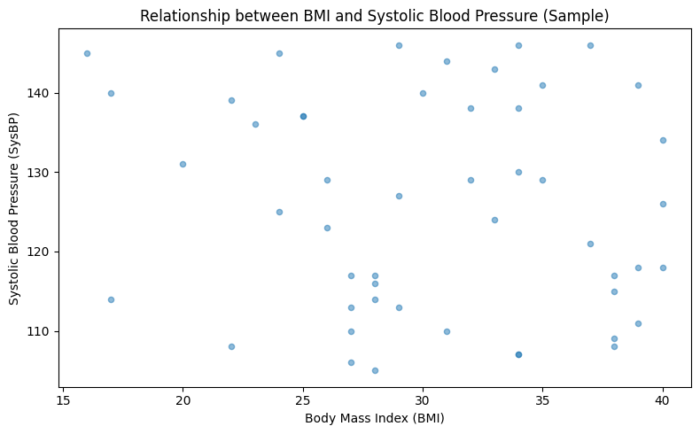
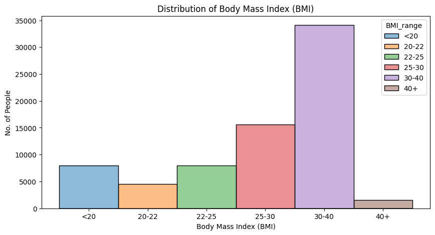

# Health Dataset Visualization

> Exploratory visualization and analysis of health data using Python

[](https://www.python.org/)
[](https://jupyter.org/)
[](LICENSE)

---

## Overview

This repository presents a comprehensive visual analysis of a health dataset using Python. The goal is to explore trends, distributions, and relationships among key health indicators including:

- **Age**
- **Heart Rate**
- **Sex**
- **BMI (Body Mass Index)**
- **Blood Pressure**
- **Heart Condition**

---

## Project Structure

```
health-data-visualization/
│
├── plots/
│   ├── barPlot.png
│   ├── boxPlot.png
│   ├── histogram.png
│   ├── lineChart.png
│   ├── pieChart.png
│   └── scatterPlot.png
│
├── Health_heart_experimental.csv
├── main.ipynb
└── README.md
```

> **Note:** All generated plots are stored in the `plots/` folder for proper rendering in this README.

---

## Visualizations & Insights

### 1️⃣ Trend of Heart Rate across Age Groups



**Insight:**  
This line chart shows the average heart rate for different age groups. The heart rate values fluctuate slightly, indicating no significant change across age ranges in the dataset.

---

### 2️⃣ BMI Ranges across Age Groups



**Insight:**  
This bar chart displays the count of individuals in different BMI ranges for each age group. Most individuals fall within the **25–30** and **30–40** BMI categories, suggesting a higher prevalence of overweight and obesity across all age groups.

---

### 3️⃣ Heart Condition Proportion



**Insight:**  
The pie chart shows the proportion of individuals with and without heart conditions. Although a slightly larger portion has no heart condition, the distribution is relatively balanced.

---

### 4️⃣ Variation in Systolic Blood Pressure



**Insight:**  
This box plot represents the distribution of systolic blood pressure values. The median lies near the center, and the spread indicates moderate variation without extreme outliers.

---

### 5️⃣ Relationship between BMI and Systolic Blood Pressure



**Insight:**  
A scatter plot using a random sample of the dataset was chosen to reduce overcrowding and improve clarity. The points are widely scattered, indicating **no strong correlation** between BMI and systolic blood pressure in this dataset.

---

### 6️⃣ Distribution of Body Mass Index



**Insight:**
This histogram shows the distribution of Body Mass Index (BMI) values in the dataset. Most individuals fall within the normal to overweight BMI range, while fewer individuals are observed in the underweight and obese categories. This indicates that the dataset mainly represents individuals with moderate BMI levels.

---

## Tools & Technologies

<div align="center">


</div>

---

## Getting Started

### Prerequisites

```bash
pip install pandas matplotlib seaborn jupyter
```

### Running the Analysis

1. **Clone the repository**
   ```bash
   git clone https://github.com/0xAnujjj/health-data-visualization.git
   cd health-data-visualization
   ```

2. **Open the Jupyter Notebook**
   ```bash
   jupyter notebook main.ipynb
   ```

3. **Run all cells** to generate visualizations

---

## Conclusion

This project demonstrates the effective use of **data visualization techniques** to explore health-related data. Key findings include:

-  **Weak correlation** between BMI and blood pressure
-  **Balanced distribution** of heart conditions
-  **High prevalence** of overweight and obesity across age groups
-  **Importance of exploratory analysis** before drawing conclusions

---

## Author

**0xAnujjj**

- GitHub: [@0xAnujjj](https://github.com/0xAnujjj)

---

<div align="center">

⭐ **If you found this project helpful, please consider giving it a star!** ⭐

  </div>
